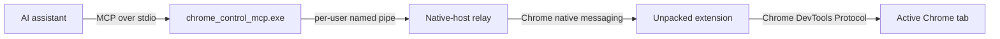

<div align="center">

# Chrome Control MCP

**Native Chrome control for AI assistants—observable, precise, and local.**

[](LICENSE)


<p>
  A standalone Model Context Protocol server that gives assistants full Chrome control through
  native messaging and the Chrome DevTools Protocol.
</p>

</div>


The pink frame, **AI CONTROL** badge, and pulsing agent cursor make active automation visible to the
person using Chrome. Model-facing screenshots hide this overlay by default; documentation captures
can include it explicitly.

## What it gives you

| Capability | Included |
|---|---|
| Semantic control | Accessibility-tree snapshots with stable element refs |
| Real input | Click, type, keys, hover, drag, select, scroll, dialogs, and media |
| Visual reasoning | Viewport/full-page PNG capture and guarded coordinate clicks |
| Browser management | Navigation, tabs, tab groups, windows, emulation, and waits |
| Browser state | Cookies, local/session storage, permissions, downloads, print, and HTTP auth |
| Extension lifecycle | Prepare, inspect, and unregister the per-user native host |

All **43 MCP tools** are exposed through strict JSON Schemas. The long-lived MCP process preserves
session and element-ref state while Chrome remains an ordinary user-controlled browser.

## See it work

| Public UI test site | Responsive E2E fixture |
|---|---|
|  |  |
| Typed value, read-back, ref click, and screenshot | Form state, coordinate click, hover, drag, and visible control presence |

Both images are direct `browser_screenshot` results from the live extension—not mockups.

> **Testing shout-out:** Inflectra's [UI Test Automation Playground](http://uitestingplayground.com/)
> and its [open-source repository](https://github.com/inflectra/ui-test-automation-playground) have
> been exceptionally useful real-world resources for this project. Its focused browser interaction
> scenarios helped us verify the complete path from MCP calls to visible Chrome behavior.

## Quick start

### 1. Build and test

Requirements: Windows x64, Chrome 116+, Visual Studio 2022 C++ tools, CMake 3.25+, Qt 6.5+ for
MSVC 2022 x64, and Node.js 20+.

```powershell
.\scripts\build.ps1 -Configuration Release
```

The build runs the automated test suites and stages:

```text
build\Release\chrome_control_mcp.exe
build\Release\Qt6Core.dll
build\Release\extension\
```

### 2. Prepare Chrome

```powershell
.\scripts\extension.ps1 -Operation install
```

Open `chrome://extensions`, enable **Developer mode**, choose **Load unpacked**, and select the
folder printed by the command. Chrome requires this one manual step for an unpacked extension.

No signing key, packaged extension, store account, administrator access, or enterprise policy is
needed. The public `key` value in `manifest.json` only keeps the unpacked extension ID stable; it
cannot sign software.

### 3. Connect an assistant

Codex CLI:

```powershell
codex mcp add chrome-control -- "C:\absolute\path\to\chrome_control_mcp.exe"
```

Claude Code:

```powershell
claude mcp add --scope local chrome-control -- "C:\absolute\path\to\chrome_control_mcp.exe"
```

Use an absolute executable path. Transport is newline-delimited JSON-RPC over stdio; the server
does not open a TCP listener.

## Architecture



One executable serves the MCP server and native-host relay roles. Browser control belongs in MCP
because it needs callable tools, image results, hardened IPC, and persistent session state; a skill
can add workflows but does not replace the server.

[Read the architecture](docs/ARCHITECTURE.md) · [Browse all tools](docs/TOOLS.md)

## Security model

Full control is powerful. Chrome Control MCP pins the extension origin, limits and validates IPC,
uses a per-user named pipe, rejects stale element refs and screenshot coordinates, bounds major
payloads, and exposes strict tool schemas.

For inspection-only use, start the MCP with:

```text
CHROME_CONTROL_MCP_SECURITY_PROFILE=read_only
CHROME_CONTROL_MCP_REDACT_SENSITIVE_OUTPUT=true
```

The read-only profile exposes 10 tools and independently refuses hidden mutating calls.

[Review the security model](docs/SECURITY.md)

## Verification

The current Windows release has passed:

- **9/9 automated suites** across contracts, IPC, security, relay, MCP, installer, and extension logic
- **43/43 live MCP tools** across **98 reversible E2E cases** in Chrome
- Real UI Playground navigation, snapshot, typing, read-back, ref click, and PNG capture
- Download/PDF cleanup, fixture-state cleanup, bridge restoration, and original Chrome-state restore

Run the same checks locally:

```powershell
.\scripts\mcp_smoke.ps1
.\scripts\mcp_smoke.ps1 -ReadOnly
node .\tests\e2e\full_browser_e2e.mjs .\dist\chrome_control_mcp.exe
.\scripts\live_browser_verify.ps1
```

To save a real overlay screenshot:

```powershell
.\scripts\live_browser_verify.ps1 -IncludeControlOverlay `
  -ScreenshotPath docs\assets\chrome-control-overlay-playground.png
```

[See versions, hashes, and claim boundaries](docs/VERIFICATION.md)

## Project identity

| Item | Value |
|---|---|
| MCP server | `chrome-control-mcp` |
| Executable | `chrome_control_mcp.exe` |
| Extension | `Chrome Control MCP` |
| Extension ID | `iojehhmnaigcejfcpmilpclmeljhlkaa` |
| Native host | `com.chromecontrolmcp.browser` |
| Local data | `%LOCALAPPDATA%\ChromeControlMCP` |

Unregister the native host with `.\scripts\extension.ps1 -Operation uninstall`, then remove the
unpacked extension manually from `chrome://extensions` when retiring it.

## License

Released under the [MIT License](LICENSE). Copyright © 2026 Randy Northrup.
