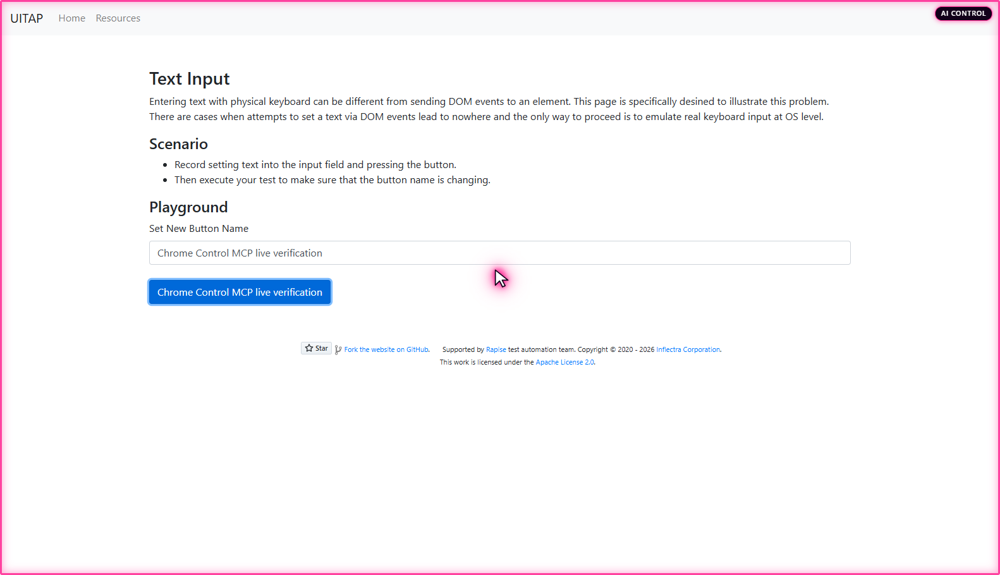
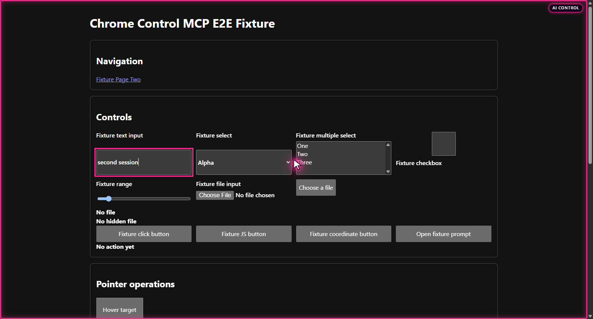
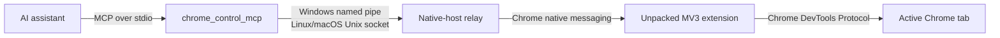

<div align="center">

# Chrome Control MCP

**Visible, precise Chrome control for AI assistants. Local by design.**

[](https://github.com/RandyNorthrup/chrome-control-mcp/actions/workflows/quality.yml)
[](https://github.com/RandyNorthrup/chrome-control-mcp/releases/latest)
[](LICENSE)


<p>
  Standalone Model Context Protocol server connecting an AI assistant to your existing Chrome
  through native messaging and Chrome DevTools Protocol.
</p>

[Releases](https://github.com/RandyNorthrup/chrome-control-mcp/releases/latest) · [Quick start](#quick-start) · [Tool catalog](docs/TOOLS.md) · [Architecture](docs/ARCHITECTURE.md) · [Security](docs/SECURITY.md) · [Verification](docs/VERIFICATION.md)

</div>



Active automation stays visible: pink frame, **AI CONTROL** badge, and pulsing agent cursor show
when an assistant controls Chrome. Model-facing screenshots hide this overlay by default;
documentation captures can opt in.

## Why this project

| Capability          | Included                                                                     |
| ------------------- | ---------------------------------------------------------------------------- |
| Semantic control    | Accessibility-tree snapshots with stable element refs                        |
| Real input          | Click, type, keys, hover, drag, select, scroll, dialogs, and media           |
| Visual reasoning    | Viewport/full-page PNG capture and guarded coordinate clicks                 |
| Browser management  | Navigation, tabs, tab groups, windows, emulation, and waits                  |
| Browser state       | Cookies, local/session storage, permissions, downloads, print, and HTTP auth |
| Extension lifecycle | Prepare, inspect, and unregister current-user native-host integration        |

All **43 MCP tools** use strict JSON Schemas. Long-lived MCP process preserves session and
element-ref state while Chrome remains an ordinary user-controlled browser.

## See it work

| Public UI test site                                                                                         | Responsive E2E fixture                                                                                                                        |
| ----------------------------------------------------------------------------------------------------------- | --------------------------------------------------------------------------------------------------------------------------------------------- |
|  |  |
| Navigation, snapshot, typing, read-back, ref click, and screenshot                                          | Form state, coordinate click, hover, drag, dialog handling, and control presence                                                              |

Both images are direct `browser_screenshot` results from live extension, not mockups.

> **Testing shout-out:** Inflectra's [UI Test Automation Playground](http://uitestingplayground.com/)
> and [open-source repository](https://github.com/inflectra/ui-test-automation-playground) provide
> focused, practical browser interaction scenarios. They have been invaluable for testing this
> project's full MCP-to-Chrome path.

## Release archives

[Download the latest release](https://github.com/RandyNorthrup/chrome-control-mcp/releases/latest)
for Windows x64, Linux x64, Apple silicon macOS, or Intel macOS. Each archive includes the MCP
executable, unpacked extension, matching Qt Core runtime, licenses, and SPDX inventory. SHA-256
checksums are published beside the assets.

All artifacts are intentionally unsigned and unnotarized; this project has no signing key and does
not require one. See the [release guide](docs/RELEASES.md) for verification, platform warnings, and
the exact packaging boundary.

## Quick start

### 1. Install build requirements

- Windows 10/11 x64, Linux x64, or macOS
- Google Chrome 116+
- CMake 3.25+
- Qt 6.5+ with Core and Test components
- C++20 compiler: Visual Studio 2022, GCC, or Clang
- Node.js 20.19+

### 2. Build and test

```shell
npm ci
npm run build
```

Default output:

| Platform      | Executable                             | Staged extension           |
| ------------- | -------------------------------------- | -------------------------- |
| Windows       | `build/Release/chrome_control_mcp.exe` | `build/Release/extension/` |
| Linux / macOS | `build/chrome_control_mcp`             | `build/extension/`         |

PowerShell users may run `./scripts/build.ps1 -Configuration Release` instead. Both paths build
with warnings-as-errors and run all native plus extension unit suites.

### 3. Prepare Chrome

```shell
npm run extension -- install
```

Open `chrome://extensions`, enable **Developer mode**, choose **Load unpacked**, then select folder
printed by command. Chrome requires this one manual step for an unpacked extension.

No signing key, packaged extension, store account, administrator access, or enterprise policy is
needed. Public `key` in `manifest.json` only pins unpacked extension ID; it cannot sign software.

### 4. Connect an assistant

Use absolute executable path.

```shell
# Windows
codex mcp add chrome-control -- "C:\absolute\path\chrome_control_mcp.exe"

# Linux / macOS
codex mcp add chrome-control -- /absolute/path/chrome_control_mcp
```

Claude Code uses same executable:

```shell
claude mcp add --scope local chrome-control -- /absolute/path/chrome_control_mcp
```

Transport is newline-delimited JSON-RPC over stdio. Server opens no TCP listener.

## Architecture



One executable serves MCP server and native-host relay roles. Browser control belongs in MCP
because it needs callable tools, image results, hardened IPC, and persistent session state. A skill
may add workflows, but does not replace server.

## Security model

Full control is powerful. Chrome Control MCP pins extension origin, limits and validates IPC,
authenticates same-user/same-executable relay, rejects stale element refs and screenshot
coordinates, bounds major payloads, and exposes strict schemas.

Windows uses current-user ACL-protected named pipe. Linux and macOS use mode-`0600` Unix socket
inside private runtime directory plus operating-system peer credentials.

For inspection-only use:

```text
CHROME_CONTROL_MCP_SECURITY_PROFILE=read_only
CHROME_CONTROL_MCP_REDACT_SENSITIVE_OUTPUT=true
```

Read-only profile exposes 10 tools and independently rejects hidden mutating calls.

## Verification

Local Windows and Linux gates currently cover:

- 9/9 native and extension suites with MSVC, GCC, and Clang
- Warnings-as-errors plus `clang-tidy` and exhaustive `cppcheck`
- Separate ASan+UBSan and TSan runs
- Full-history Gitleaks scan and npm dependency audit
- 43/43 live MCP tools through real Chrome on Windows
- Public UI Playground navigation, snapshot, typing, click, and PNG capture
- Reversible native-host install/status/uninstall lifecycle

GitHub Actions builds and tests Windows, Linux, and macOS on every direct push.

```shell
npm run smoke
npm run smoke:read-only
node tests/e2e/full_browser_e2e.mjs
```

PowerShell live public-site check:

```powershell
./scripts/live_browser_verify.ps1 -Site http://uitestingplayground.com/
```

[See exact evidence and claim boundaries](docs/VERIFICATION.md).

## Project identity

| Item         | Value                              |
| ------------ | ---------------------------------- |
| MCP server   | `chrome-control-mcp`               |
| Executable   | `chrome_control_mcp[.exe]`         |
| Extension    | `Chrome Control MCP`               |
| Extension ID | `iojehhmnaigcejfcpmilpclmeljhlkaa` |
| Native host  | `com.chromecontrolmcp.browser`     |

Unregister current-user native host with `npm run extension -- uninstall`, then remove unpacked
extension manually from `chrome://extensions` when retiring it.

## License

Released under [MIT License](LICENSE). Copyright © 2026 Randy Northrup.
