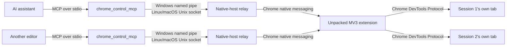

<div align="center">

# Chrome Control MCP

**Visible, precise Chrome control for AI assistants. Local by design.**

[](https://github.com/RandyNorthrup/chrome-control-mcp/actions/workflows/quality.yml)
[](https://github.com/RandyNorthrup/chrome-control-mcp/releases/latest)
[](https://marketplace.visualstudio.com/items?itemName=RandyNorthrup.chrome-control-mcp)
[](LICENSE)


<p>
  Standalone Model Context Protocol server connecting an AI assistant to your existing Chrome
  through native messaging and Chrome DevTools Protocol.
</p>

[Install](#install) · [Updating](#staying-up-to-date) · [Tool catalog](docs/TOOLS.md) · [Architecture](docs/ARCHITECTURE.md) · [Security](docs/SECURITY.md) · [Verification](docs/VERIFICATION.md)

</div>


Active automation stays visible: pink frame, **AI CONTROL** badge, and pulsing agent cursor show
when an assistant controls Chrome, and the tab under control sits in a pink **AI CONTROL** tab
group, so it is identifiable in the tab strip without opening it. Model-facing screenshots hide the
page overlay by default; documentation captures can opt in.

## Why this project

| Capability           | Included                                                                                                                                                                                                            |
| -------------------- | ------------------------------------------------------------------------------------------------------------------------------------------------------------------------------------------------------------------- |
| Works beside you     | Session drives its own visible tab and never changes which tab is in front, raises a window, or asks for OS focus. `browser_window new` reports `took_os_focus` when a compositor focuses the new window regardless |
| Semantic control     | Accessibility-tree snapshots with stable element refs                                                                                                                                                               |
| Real input           | Click, type, keys, hover, drag, select, scroll, dialogs, and media                                                                                                                                                  |
| File upload          | Attach local files to a page's file input, as the user's own picker would                                                                                                                                           |
| Visual reasoning     | Viewport/full-page PNG capture and guarded coordinate clicks                                                                                                                                                        |
| Browser management   | Navigation, tabs, tab groups, windows, emulation, and waits                                                                                                                                                         |
| Browser state        | Cookies, local/session storage, permissions, downloads, print, and HTTP auth                                                                                                                                        |
| A session per editor | Several editors drive Chrome at once, each owning its own tab and unable to touch another's                                                                                                                         |
| Tab recording        | Record the session's tab to a `.webm` with a machine-readable timeline of the commands that ran                                                                                                                     |
| Extension lifecycle  | Prepare, inspect, and unregister current-user native-host integration                                                                                                                                               |
| In-place updates     | Check, download, verify, and install a new release without overwriting the running executable                                                                                                                       |

All **49 MCP tools** use strict JSON Schemas. Long-lived MCP process preserves session and
element-ref state while Chrome remains an ordinary user-controlled browser.

Since 1.5.0 several servers run side by side -- one per editor window -- and each gets its own
session, its own tab, and no way to reach another session's tab. A second editor takes a tab the
normal way: `browser_new_tab` opens one in the background and makes it that session's. Asking for a
tab another session is driving is refused by name, so "busy" reads differently from "gone", and
`browser_tabs` marks such a tab `controlled_by_other_session` rather than hiding it -- the operator
sees the whole window either way. The constraints that shaped this, and the ones that ruled other
designs out, are in [docs/MULTI_SESSION.md](docs/MULTI_SESSION.md).

Recording a run is two tools:

```text
browser_record_start    begin recording the session's tab to a .webm
browser_record_stop     end it, and return the saved path and a command timeline
```

The video never comes back through a tool reply -- the bridge is one command, one reply, with hard
caps on the reply -- so stop returns a path. Beside the `.webm` it writes a `.timeline.json` naming
every command that ran while recording, with its offset in milliseconds, so the video can be read
against what drove it.

## See it work


The two captures on this page were taken **at the same time, by two different MCP servers**. The
first drove the public playground: navigation, snapshot, typing, read-back, a ref click, and the
screenshot itself. The second opened a tab of its own on the local E2E fixture and typed into it —
the text reading `second session` is its work — while the first went on driving the playground and
neither could touch the other's tab.

Both are direct `browser_screenshot` results from the live extension with
`include_control_overlay`, not mockups.

> **Testing shout-out:** Inflectra's [UI Test Automation Playground](http://uitestingplayground.com/)
> and [open-source repository](https://github.com/inflectra/ui-test-automation-playground) provide
> focused, practical browser interaction scenarios. They have been invaluable for testing this
> project's full MCP-to-Chrome path.

## Install

### From the VS Code Marketplace

Install **Chrome Control MCP** from the marketplace, or:

```shell
code --install-extension RandyNorthrup.chrome-control-mcp
```

The marketplace serves the build for your platform. The extension installs the server on first
activation and registers it with the editor through the MCP server definition provider API, so there
is no `mcp.json` to edit and no path to know. Marketplace updates and the server updating itself
land in the same install; whichever is newer runs.

One manual step remains, and only once. Run **Chrome Control MCP: Show the Chrome extension folder
to load** from the command palette: it copies the folder path and opens it. Then in Chrome open
`chrome://extensions`, turn on **Developer mode**, choose **Load unpacked**, and pick that folder.
Why that cannot be automated is explained under [Prepare Chrome](#3-prepare-chrome). The other
command, **Chrome Control MCP: Repair install**, reinstalls the server and its native-host
registration.

### From a release archive

[Download the latest release](https://github.com/RandyNorthrup/chrome-control-mcp/releases/latest)
for Windows x64, Linux x64, Apple silicon macOS, or Intel macOS, unpack it, and run:

```shell
# Windows
.\chrome_control_mcp.exe --install

# Linux / macOS
./chrome_control_mcp --install
```

That installs the server where it can update itself and prints the command path to give your
assistant, plus the folder to load into Chrome. Both stay the same through every later update.

Each archive carries the MCP executable, the unpacked extension, the matching Qt Core and Qt Network
runtime, the platform's Qt TLS backend, licenses, and an SPDX inventory; the Linux archives also
carry the ICU libraries Qt Core links against there. SHA-256 checksums are published beside the
assets.

All artifacts are intentionally unsigned and unnotarized; this project has no signing key and does
not require one. See the [release guide](docs/RELEASES.md) for verification, platform warnings, and
the exact packaging boundary.

## Quick start (from source)

### 1. Install build requirements

- Windows 10/11 x64, Linux x64, or macOS
- Google Chrome 116+
- CMake 3.25+
- Qt 6.5+ with Core, Network, and Test components
- C++20 compiler: Visual Studio 2022, GCC, or Clang
- Node.js 20.19+

### 2. Build and test

```shell
npm ci
npm run build
```

Default output:

| Platform      | Executable                             | Staged extension           |
| ------------- | -------------------------------------- | -------------------------- |
| Windows       | `build/Release/chrome_control_mcp.exe` | `build/Release/extension/` |
| Linux / macOS | `build/chrome_control_mcp`             | `build/extension/`         |

PowerShell users may run `./scripts/build.ps1 -Configuration Release` instead. Both paths build
with warnings-as-errors and run all native plus extension unit suites.

### 3. Prepare Chrome

```shell
npm run extension -- install
```

Open `chrome://extensions`, enable **Developer mode**, choose **Load unpacked**, then select folder
printed by command.

**This step is manual and cannot be automated. That is Chrome's decision, not an omission here.**
Branded Chrome 137 and later ignore `--load-extension`; only Chromium and Chrome for Testing still
honour it. Installing by enterprise policy needs a Web Store listing and a packaged, signed
extension, which this project deliberately does not have. Driving the browser's own windows with a
UI-automation tool is not an install path either: it takes over the user's screen and breaks on any
Chrome or locale change. An assistant asked to set this up should print the folder and the three
clicks and hand the keyboard back; there is no workaround to go looking for.

No signing key, packaged extension, store account, administrator access, or enterprise policy is
needed. Public `key` in `manifest.json` only pins unpacked extension ID; it cannot sign software.

### 4. Connect an assistant

Use absolute executable path.

```shell
# Windows
codex mcp add chrome-control -- "C:\absolute\path\chrome_control_mcp.exe"

# Linux / macOS
codex mcp add chrome-control -- /absolute/path/chrome_control_mcp
```

Claude Code uses same executable:

```shell
claude mcp add --scope local chrome-control -- /absolute/path/chrome_control_mcp
```

Prefer the path `--install` prints over a build-directory path: only the former survives an
update.

Transport is newline-delimited JSON-RPC over stdio. Server opens no TCP listener.

## Staying up to date

```text
browser_update_status   where this build is installed, and which versions are present
browser_update_check    what the newest release is
browser_update_apply    install it
```

`browser_update_status` touches no network. The executable also answers `--version`, and `--install`
puts a copy into the managed layout without an MCP client in the loop. `--install` reports
`installed: true` or `false`: it copies nothing when that version is already installed and already
current, which is the normal case on every editor start, and a rebuilt tree of the same version
needs a new version number rather than a second install.

A running executable cannot be overwritten on Windows, so the update never tries to. Each version
is installed into `<root>/versions/<version>` and a `current` link -- a directory junction on
Windows, a symbolic link on Linux and macOS -- is repointed at it. The link can be repointed while
a server started through it keeps serving; the new build takes effect the next time the client
starts the server.

The MCP command path, Chrome's unpacked-extension folder, and the native-messaging registration all
point through `current`, so none of them changes when a new version lands. Nothing to reconfigure
and no folder to pick again.

Two things do still have to be restarted for a new build to take effect, because neither Chrome nor
your editor reloads code underneath a running process: restart the MCP server in your client, and
press reload on the extension at `chrome://extensions` (a Chrome restart does the same). Until the
server restarts it keeps serving the old build.

The first `browser_update_apply` from a build tree or an unpacked download moves that copy into the
managed layout and prints the path to point your client at. That is the only time the path changes.

| Platform | Install root                                         |
| -------- | ---------------------------------------------------- |
| Windows  | `%LOCALAPPDATA%\Programs\ChromeControlMCP`           |
| Linux    | `~/.local/share/ChromeControlMCP/app`                |
| macOS    | `~/Library/Application Support/ChromeControlMCP/app` |

Set `CHROME_CONTROL_MCP_INSTALL_ROOT` to install somewhere else. Downloads are checked against the
SHA-256 published with the release, which catches a corrupted or truncated transfer; it is not a
signature, and this project still ships no signing key.

## Architecture



One executable serves MCP server and native-host relay roles. Each server publishes its own
rendezvous record and gets its own relay; the one extension holds a session per relay and keeps
their tabs apart. Browser control belongs in MCP
because it needs callable tools, image results, hardened IPC, and persistent session state. A skill
may add workflows, but does not replace server.

## Security model

Full control is powerful. Chrome Control MCP pins extension origin, limits and validates IPC,
authenticates same-user/same-executable relay, rejects stale element refs and screenshot
coordinates, bounds major payloads, and exposes strict schemas.

Windows uses current-user ACL-protected named pipe. Linux and macOS use mode-`0600` Unix socket
inside private runtime directory plus operating-system peer credentials.

For inspection-only use:

```text
CHROME_CONTROL_MCP_SECURITY_PROFILE=read_only
CHROME_CONTROL_MCP_REDACT_SENSITIVE_OUTPUT=true
```

Read-only profile exposes 12 tools and independently rejects hidden mutating calls.
`browser_update_apply` is not among them: it replaces the program on disk, which is a mutation
whatever the browser profile says.

Recording is not an escalation. `browser_record_start` captures frames through the `debugger`
permission the extension already holds and already uses for every click and snapshot, not through
`tabCapture`, and it grants nothing the session could not already do. It records the session's own
tab only, and a session that ends mid-recording has its partial file discarded rather than finished
-- a truncated video presented as a complete one would be worse than no file. There is no separate
recording indicator, because the frames come from the debugger rather than from `tabCapture`; what
Chrome shows is the debugging banner that is up for the whole session, recording or not. The permission set is documented in
[docs/SECURITY.md](docs/SECURITY.md).

## Verification

Local gates currently cover:

- 19/19 native and extension suites on Windows and 18/18 on Linux and macOS, with MSVC, GCC,
  and Clang. One suite is Windows-only: it asks whether a directory junction can make one file
  look like two processes, which is a question the POSIX symbolic link does not raise.
- Warnings-as-errors plus `clang-tidy` and exhaustive `cppcheck`
- Separate ASan+UBSan and TSan runs
- Full-history Gitleaks scan and npm dependency audit
- 44/44 live browser and extension tools through real Chrome on Windows. The three
  `browser_update_*` tools are not browser tools and are not part of that run; their evidence is
  below. The two `browser_record_*` tools are not in that figure, which predates them; they were
  exercised against real Chrome on 2026-09-23, producing a playable `.webm` and the sidecar
  timeline beside it.
- 35/35 display configurations on Windows and macOS: scales 1x to 3x, zoom 25% to 500%, pinch, and
  both scrollbar kinds, each coordinate proven by where its click landed
- Public UI Playground navigation, snapshot, typing, click, and PNG capture
- Reversible native-host install/status/uninstall lifecycle

The update path is verified on Windows and macOS: the link is repointed while a server launched
through it keeps serving and exits cleanly, and on macOS 15.7.4 a published archive installs and
reaches the release host over HTTPS through its bundled TLS backend. No Linux machine has yet
installed a release through `browser_update_apply`.

GitHub Actions builds and tests Windows, Linux, and macOS on every direct push.

```shell
npm run smoke
npm run smoke:read-only
node tests/e2e/full_browser_e2e.mjs
```

PowerShell live public-site check:

```powershell
./scripts/live_browser_verify.ps1 -Site http://uitestingplayground.com/
```

[See exact evidence and claim boundaries](docs/VERIFICATION.md).

## Project identity

| Item         | Value                              |
| ------------ | ---------------------------------- |
| MCP server   | `chrome-control-mcp`               |
| Executable   | `chrome_control_mcp[.exe]`         |
| Extension    | `Chrome Control MCP`               |
| Extension ID | `iojehhmnaigcejfcpmilpclmeljhlkaa` |
| Native host  | `com.chromecontrolmcp.browser`     |

Unregister current-user native host with `npm run extension -- uninstall`, then remove unpacked
extension manually from `chrome://extensions` when retiring it.

## License

Released under [MIT License](LICENSE). Copyright © 2026 Randy Northrup.

## Support this project

If this project saves you time, you can
[buy me a coffee](https://www.paypal.com/donate/?hosted_button_id=Q9VC7B42R7K82)
via PayPal. Thank you!
